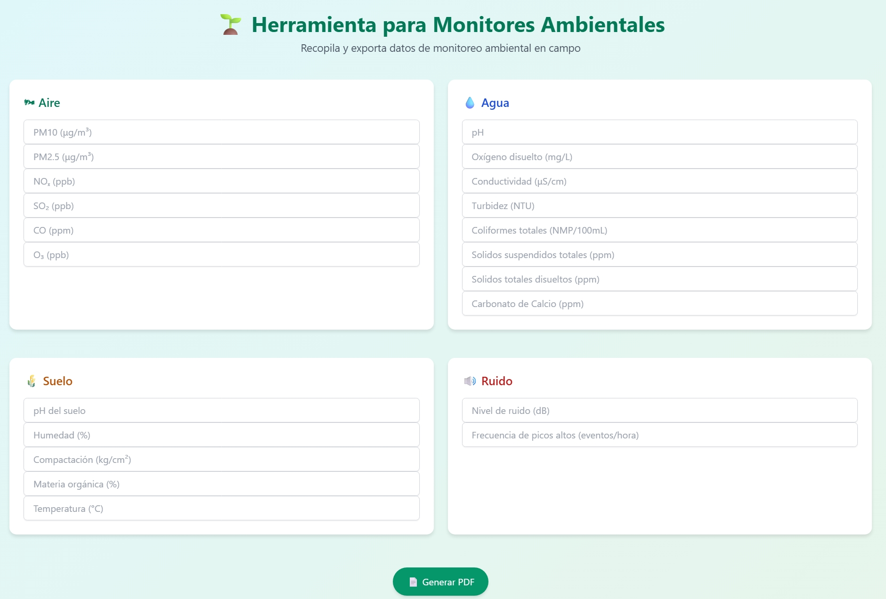

# 🌿 Herramienta para Monitores Ambientales

Una aplicación web ligera, práctica y bonita para que monitores ambientales puedan **registrar, visualizar y exportar datos de campo** sobre aire, agua, suelo y ruido en formato PDF. Desarrollada con amor por y para quienes le meten la ficha a cuidar el planeta 🌎💚.

---

  

---

## 🚀 ¿Qué hace esta herramienta?

✔️ Permite registrar parámetros ambientales comunes como:

- **Aire:** PM10, PM2.5, NO₂, SO₂, CO, O₃  
- **Agua:** pH, oxígeno disuelto, turbidez, coliformes, conductividad  
- **Suelo:** pH, humedad, temperatura, materia orgánica, compactación  
- **Ruido:** decibeles y picos sonoros

✔️ Exporta los datos directamente a **PDF** con un clic  
✔️ Incluye una **guía integrada** con referencias legales colombianas  
✔️ **Responsiva y bonita**, lista para celulares y tablets  
✔️ Totalmente **offline**, ideal para usar en campo o en laboratorio  
✔️ Desplegable como GitHub Page con cero backend

---

## 🧪 Tecnología usada

- [HTML5](https://developer.mozilla.org/es/docs/Web/HTML)
- [TailwindCSS](https://tailwindcss.com/)
- [JavaScript](https://developer.mozilla.org/es/docs/Web/JavaScript)
- [jsPDF](https://github.com/parallax/jsPDF) para la exportación en PDF

---

## Vista Previa 

  

---

## 📘 Guía de monitoreo ambiental

Esta herramienta incluye referencias a normativa colombiana vigente como:

- **Resolución 2254 de 2017** – Establece los niveles permisibles de calidad del aire en Colombia.
- **Resolución 627 de 2006** – Define los valores límite de ruido ambiental y ocupacional.
- **Decreto 1594 de 1984** – Reglamenta los usos del recurso hídrico y calidad del agua.
- **Resolución 2115 de 2007** – Establece los parámetros de calidad del agua potable.
- **Decreto 1072 de 2015** – Compila normas del Sistema de Gestión en Seguridad y Salud en el Trabajo (SG-SST).

> 📌 Todos estos marcos normativos son clave para que el monitoreo ambiental se haga de forma legal, técnica y segura.

---

## 🧤 Para monitores y estudiantes

Esta herramienta está pensada para:

- 👨‍🔬 **Monitores ambientales** en salidas de campo, laboratorios o prácticas.
- 📚 **Estudiantes** de carreras como ingeniería ambiental, biología, química, geología.
- 👩‍🏫 **Docentes** que buscan dinamizar sus clases con tecnología y prácticas reales.
- 🌎 **Investigadores** que necesitan un respaldo digital rápido y sin conexión.

---

## 📄 Licencia

Este proyecto está bajo la licencia **MIT**.

> Puedes usarlo, adaptarlo, modificarlo o compartirlo libremente.  
> Solo te pido que, si puedes, me menciones o des crédito.  
> ¡Y si mejoras algo, mándame un pull request! 💚

---

## ✨ Autor

Desarrollado con cariño por **Santiago Díaz**   
📧 ¿Comentarios, sugerencias o mejoras?  
Contáctame o deja tu ⭐ en el repo si te sirvió 👉 [GitHub](https://github.com/santiag0jaja/Monitoreoambiental)

